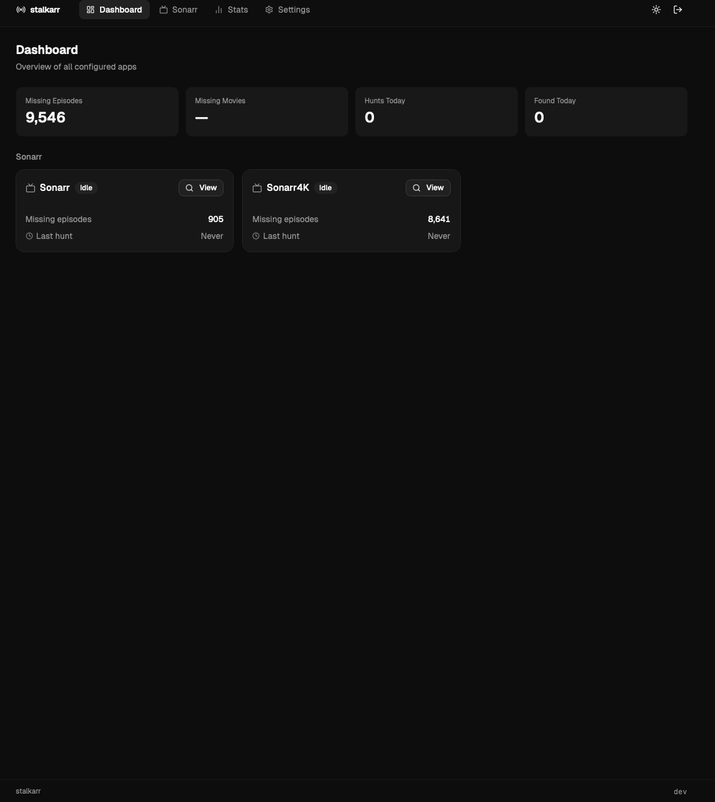
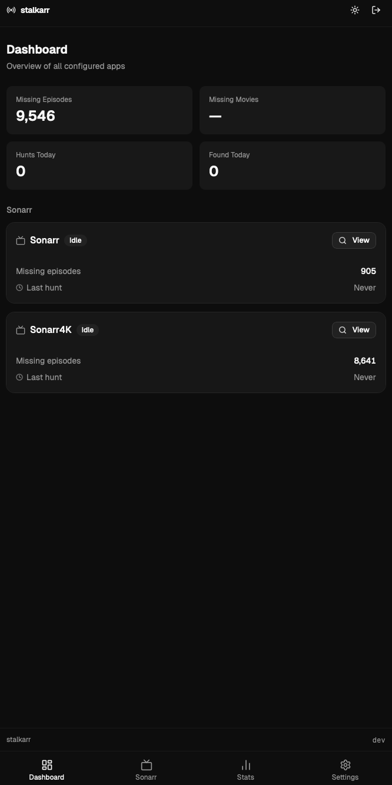

# STALKARR

> **Personal project in BETA!** I built this for my own homelab using the tools I use daily: [Zed](https://zed.dev), [Claude](https://claude.ai), and [OpenCode](https://opencode.ai). AI is part of my regular workflow the same way Stack Overflow and docs always have been. If you spot any issues, chuck in a ticket and I'll get to it.

A self-hosted dashboard for searching missing media across your arr stack.

> Currently supports **Sonarr**. Radarr support coming soon.

<p align="center">
  
  
</p>

## Quick start
```bash
# 1. Copy the env file and set your JWT secret
cp .env.example .env
# Edit .env — generate a secret with:
# openssl rand -hex 32

# 2. Start
docker compose up -d

# 3. Open http://localhost:8080 and create your admin account
```

## docker-compose.yml
```yaml
services:
  stalkarr:
    image: ghcr.io/codevski/stalkarr:latest
    container_name: stalkarr
    restart: unless-stopped
    ports:
      - "8080:8080"
    volumes:
      - ./config:/config
    env_file:
      - .env
```

## Configuration

All configuration is stored in `/config/config.json` and managed through the UI. Environment variables are for startup only.

| Variable | Required | Default | Description |
|---|---|---|---|
| `JWT_SECRET` | Yes | — | Secret for signing JWT tokens. Generate with `openssl rand -hex 32` |
| `PORT` | No | `8080` | Port to listen on |
| `DATA_DIR` | No | `/config` | Path to store config.json |
| `GIN_MODE` | No | `release` | Set to `debug` to enable verbose request logging |

## File permissions (NAS / homelab)

If file ownership matters on your setup, set `PUID` and `PGID` to match your user:
```bash
id
# uid=1000(youruser) gid=1000(yourgroup)
```
```yaml
environment:
  - PUID=1000
  - PGID=1000
  - TZ=Australia/Melbourne
```

This ensures `/config` files are owned by your user rather than root.

## Development
```bash
# Backend (with hot reload)
air

# Frontend (separate terminal)
cd frontend && bun run dev
```

See `bruno/stalkarr/` for the API collection.

## License

MIT
